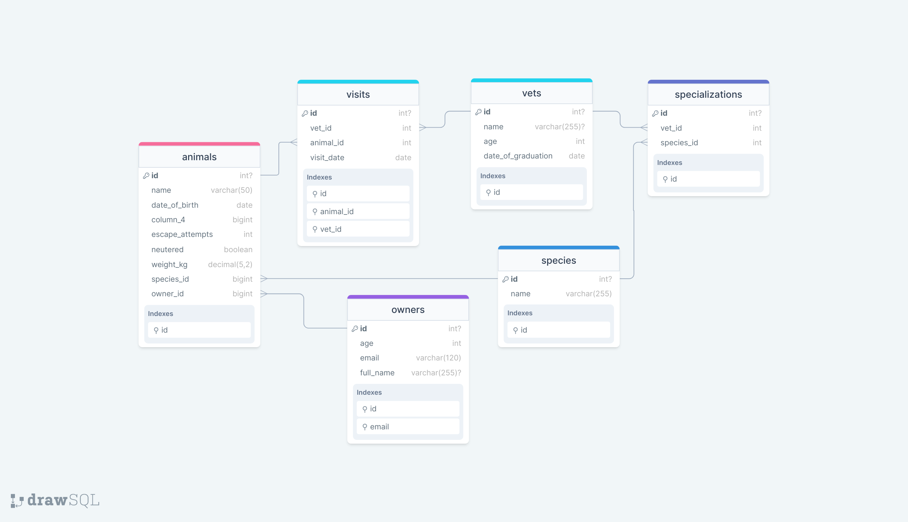

<a name="readme-top"></a>

<div align="center">
  <h2>Database schema's diagram</h2><br>
  
  <br/>

  <h3><b>Welcome to my project</b></h3>

</div>

<!-- TABLE OF CONTENTS -->

# 📗 Table of Contents

- [📖 About the Project](#about-project)
  - [🛠 Built With](#built-with)
    - [Tech Stack](#tech-stack)
    - [Key Features](#key-features)
- [💻 Getting Started](#getting-started)
  - [Setup](#setup)
  - [Prerequisites](#prerequisites)
  - [Deployment](#deployment)
- [👥 Authors](#authors)
- [🔭 Future Features](#future-features)
- [🤝 Contributing](#contributing)
- [⭐️ Show your support](#support)
- [🙏 Acknowledgements](#acknowledgements)
- [📝 License](#license)

<!-- PROJECT DESCRIPTION -->

# 📖 [Vet linic] <a name="about-project"></a>

**[Vet linic]** "An SQL project where I create a simple table, and Insert some data into it, I also added some queries to filter and sort data."

## 🛠 Built With <a name="built-with"></a>

### Tech Stack <a name="tech-stack"></a>

<details>
  <summary>Database</summary>
  <ul>
    <li><a href="https://www.postgresql.org/">PostgreSQL</a></li>
  </ul>
</details>


<!-- Features -->

### Key Features <a name="key-features"></a>

- **[Create a table]**
- **[Insert into the table]**
- **[Filter data]**

<p align="right">(<a href="#readme-top">back to top</a>)</p>

<!-- GETTING STARTED -->

## 💻 Getting Started <a name="getting-started"></a>

### Prerequisites

In order to run this project you need to:

- Install PostgreSQL

### Setup

Clone this repository to your desired folder using these commands:

```sh
 $ git clone https://github.com/otmaneechchafyky/vet_linic_database.git
 $ cd file-name
```
### Deployment

You can deploy this project using:

Example:

```sh
  - Github
```

<p align="right">(<a href="#readme-top">back to top</a>)</p>

<!-- AUTHORS -->

## 👥 Authors <a name="authors"></a>


👤 **Otmane Echchafyky**

- GitHub: [@otmaneechchafyky](https://github.com/otmaneechchafyky)
- Twitter: [@EchchafykyO](https://twitter.com/EchchafykyO)
- LinkedIn: [otmane-echchafyky](https://www.linkedin.com/in/otmane-echchafyky/)

<p align="right">(<a href="#readme-top">back to top</a>)</p>

<!-- FUTURE FEATURES -->

## 🔭 Future Features <a name="future-features"></a>

- **[Adding option to add more favorite animes]**
- **[Adding option to like and dislike a specific anime]**

<p align="right">(<a href="#readme-top">back to top</a>)</p>

<!-- CONTRIBUTING -->

## 🤝 Contributing <a name="contributing"></a>

Contributions, issues, and feature requests are welcome!

Feel free to check the [issues page](https://github.com/otmaneechchafyky/vet_linic_database/issues).

<p align="right">(<a href="#readme-top">back to top</a>)</p>

<!-- SUPPORT -->

## ⭐️ Show your support <a name="support"></a>

If you like this project give it a ⭐️ to keep us motivated.

<p align="right">(<a href="#readme-top">back to top</a>)</p>

<!-- ACKNOWLEDGEMENTS -->

## 🙏 Acknowledgments <a name="acknowledgements"></a>


I would like to thank Microverse community for support and Nelson sakwa for the great design.

<p align="right">(<a href="#readme-top">back to top</a>)</p>

<!-- LICENSE -->

## 📝 License <a name="license"></a>

This project is [MIT](./LICENSE) licensed.

<p align="right">(<a href="#readme-top">back to top</a>)</p>
